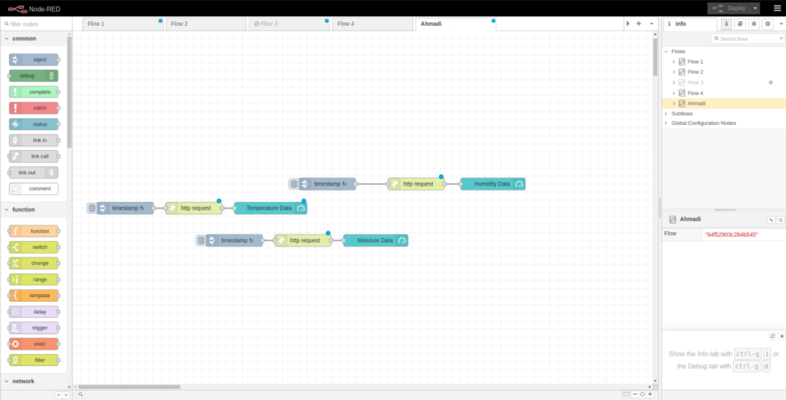

# IoT Project - ESP8266 with DHT11, YL-69, and Node-RED Integration

This project demonstrates the use of ESP8266 microcontrollers to monitor environmental conditions using sensors like DHT11 and YL-69. The data collected is then sent to a Node-RED dashboard for visualization and further processing.

## Project Components

### 1. `esp8266_dht11_nodered.ino`
This sketch sets up an ESP8266 to read temperature and humidity from a DHT11 sensor. It serves the data over a simple web server.

#### Key Features:
- **WiFi Connection:** Connects to a specified WiFi network.
- **Web Server:** Hosts a server that provides endpoints for temperature and humidity data.
- **LED Indicator:** Turns on an LED if conditions are not optimal for vermicomposting.

#### Endpoints:
- `/dht-temp`: Returns the current temperature.
- `/dht-hum`: Returns the current humidity.

### 2. `esp8266_yl69_nodered.ino`
This sketch sets up an ESP8266 to read soil moisture levels using a YL-69 sensor.

#### Key Features:
- **WiFi Connection:** Connects to a specified WiFi network.
- **Web Server:** Hosts a server that provides an endpoint for soil moisture data.

#### Endpoint:
- `/moisture`: Returns the current soil moisture level as a percentage.

### 3. `esp8266_dht11_kaa.ino`
This sketch extends the functionality of the DHT11 example by integrating with the Kaa IoT platform for remote monitoring and control.

#### Key Features:
- **MQTT Communication:** Publishes temperature and humidity data to an MQTT server.
- **WiFi and MQTT Reconnection:** Automatically reconnects to WiFi and MQTT broker if the connection is lost.

#### MQTT Topics:
- Publishes data to `kp1/<APP_VERSION>/dcx/<TOKEN>/json`.
- Listens for commands on `kp1/<APP_VERSION>/cex/<TOKEN>/command/SWITCH/status`.

### 4. `node_red_flows.json`
This JSON file defines a Node-RED flow for visualizing data collected from the ESP8266 devices.

#### Key Features:
- **Temperature Gauge:** Displays temperature data from the ESP8266.
- **Humidity Gauge:** Displays humidity data from the ESP8266.
- **HTTP Requests:** Retrieves data from the ESP8266 endpoints and updates the gauges.

## Screenshots

### Node-RED Dashboard

### Node-RED Flow

### System Schematic

## Setup Instructions

1. **Hardware Setup:**
   - Connect the DHT11 sensor to the ESP8266.
   - Connect the YL-69 sensor to the ESP8266.

2. **Software Setup:**
   - Install the required libraries in the Arduino IDE:
     - `ESP8266WiFi`
     - `DHT`
     - `PubSubClient`
     - `ArduinoJson`
   - Upload the respective sketches (`.ino` files) to the ESP8266 devices.

3. **Node-RED Setup:**
   - Import `node_red_flows.json` into Node-RED.
   - Ensure the ESP8266 devices are connected to the same network as the Node-RED server.
   - Update the IP addresses in the Node-RED flow to match the IPs of your ESP8266 devices.

4. **Configuration:**
   - Update WiFi credentials (`ssid` and `password`) in the `.ino` files.
   - Configure MQTT broker details if using `esp8266_dht11_kaa.ino`.

## Usage

- Access the Node-RED dashboard to view real-time temperature and humidity data.
- Use the web server endpoints for direct data retrieval from the ESP8266 devices.
- Monitor and control the devices remotely using the Kaa IoT platform.
